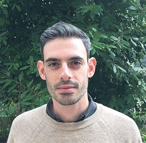
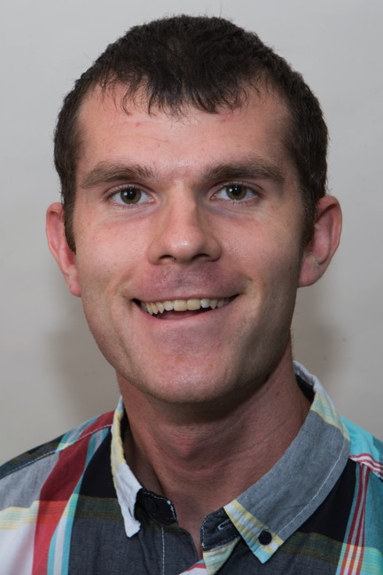
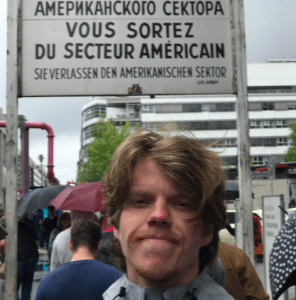

---
# You don't need to edit this file, it's empty on purpose.
# Edit theme's home layout instead if you wanna make some changes
# See: https://jekyllrb.com/docs/themes/#overriding-theme-defaults
layout: home
---

### Principal Investigator
---
#### **Tal Linzen**		

email: <a href="mailto: tal.linzen@jhu.edu">tal.linzen@jhu.edu</a>

{:style="width:200px;"}

  

### Post-Doc
---
#### **Marten Van Schijndel**

email: <a href="mailto: mvansch2@jhu.edu">mvansch2@jhu.edu</a>

{:style="width:200px;"}

   

### PhD Students
---
#### **Grusha Sai Prasad**

email: <a href="mailto: gsaipra1@jhu.edu">gsaipra1@jhu.edu</a>

{:style="width:200px;"}

  

---
#### **Tom McCoy**

email: <a href='mailto: tom.mccoy@jhu.edu'>tom.mccoy@jhu.edu</a>

{:style='width:200px;'}

   

### Lab Manager
---
#### **Brian Leonard** 

email: <a href="mailto: bleona10@jhu.edu">bleona10@jhu.edu</a>

{:style="width:200px;"}
