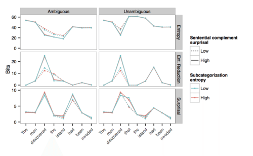
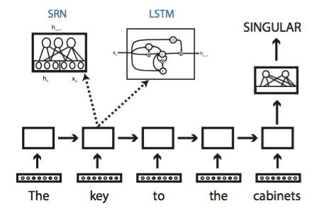
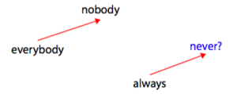
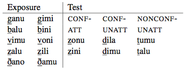
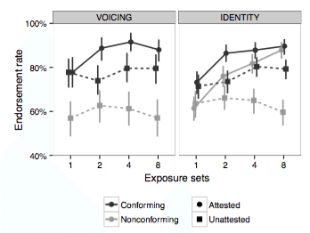

---
# You don't need to edit this file, it's empty on purpose.
# Edit theme's home layout instead if you wanna make some changes
# See: https://jekyllrb.com/docs/themes/#overriding-theme-defaults
layout: home
nav-weight : 2
---

## **Research**

___________________________________________________________________________

### Expectation-based language comprehension

The probability of a word or a syntactic structure is a major predictor of how difficult they are to read. What are the syntactic representations over which those probability distributions are maintained? How is processing difficulty affected by the probability distribution we maintain over the representations we predict, and in particular, our uncertainty about the structure and meaning of the sentence?

We can study these questions by implementing computational models that which incorporate different representational assumptions, and deriving quantitative predictions from those models:

{:style="display:block;margin:0 auto;"}

We can then measure to what extent these predictions match up with human sentence comprehension processes, as measured by reading times (eyetracking, self-paced reading) or neural measurements such as MEG.

Expectations are sometimes malleable and context-specific. If the person we’re talking to is unusually fond of a particular syntactic construction, say passive verbs, we might learn to expect them to use this construction more often than other people. In ongoing research, we’re investigating the extent to which our expectations for specific syntactic representations can vary from context to context.

### Linguistic representations in artificial neural networks

Artificial neural networks are a powerful statistical learning technique that underpins some of the best-performing artificial intelligence software we have. Many of the neural networks that have been successful in practical applications do not have any explicit linguistic representations (e.g., syntax trees or logical forms). Is the performance of neural networks really as impressive when evaluated using rigorous linguistic and psycholinguistic tests? If so, how do these networks represent or approximate the structures that are normally seen as the building blocks of language?

{:style="display:block;margin:0 auto;"}

A related topic of research is lexical representations in neural networks. Neural networks are typically allowed to evolve their own lexical representations, which are normally nothing but unstructured lists of numbers. We have explored to what extent such lexical representations implicitly capture the linguistic distinctions that are assumed in linguistics (in particular, formal semantics).

{:style="display:block;margin:0 auto;"}

### Generalization in language

We regularly generalize our knowledge of language to words and sentences we have never heard before. When is our linguistic knowledge limited to a specific item, and when do we apply it to novel items? What representations do we use to generalize beyond the specific items that we have encountered?

We can often study these questions using artificial language learning experiments. In one experiment, for example, we taught participants an artificial language with a simple phonological regularity, and tested how they generalized this regularity to new sounds:

{:style="display:block;margin:0 auto;"}

{:style="display:block;margin:0 auto;"}
